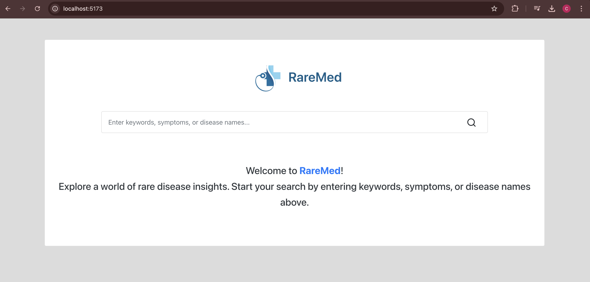
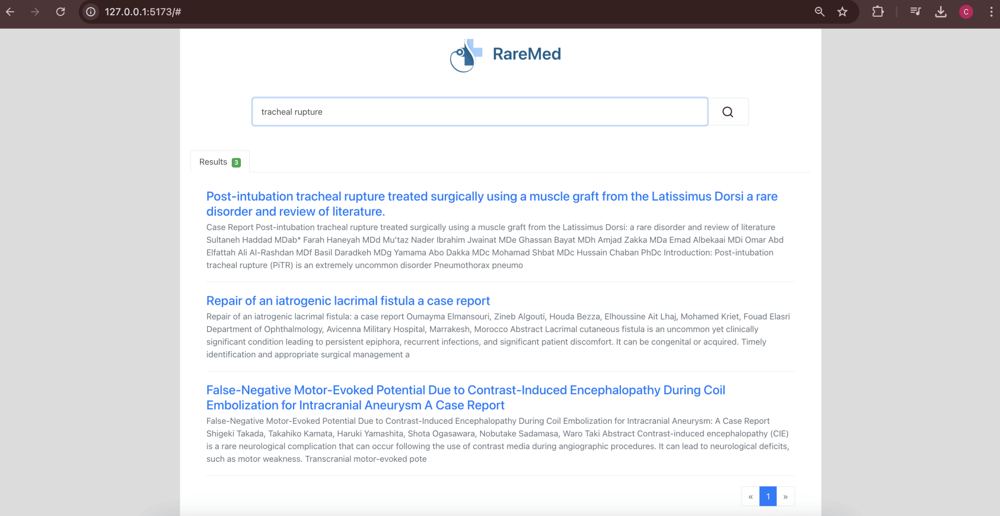

# Système de Recherche de Maladies Rares à partir des Articles Scientifiques

  

## Description du Projet
Ce projet vise à développer un système de recherche d'information permettant de détecter des maladies rares à partir de documents scientifiques (principalement des articles PDF). Ce système inclut des étapes de **prétraitement des données**, d'**indexation** et de **recherche** via un modèle vectoriel **TF-IDF**. 
L’objectif principal est d’extraire les informations pertinentes à partir des textes scientifiques pour permettre des recherches efficaces et rapides.

## Fonctionnalités principales
### 1. Prétraitement des Données :
   - **Chargement et extraction de textes** à partir de fichiers **PDF**.
   - **Nettoyage des textes** : normalisation et suppression des caractères spéciaux.
   - **Tokenisation des mots** et filtrage des **stopwords**.
   - **Lemmatisation des mots** pour les réduire à leur forme canonique.
   - Application de la méthode **TF-IDF** pour la représentation vectorielle des documents.

### 2. Indexation :
   - Création d’un **index inversé** à partir des représentations TF-IDF des documents.
   - Analyse des documents pour générer des fréquences de termes, leurs positions et scores TF-IDF.
   - Construction d'un index inversé permettant une recherche rapide des termes.

### 3. Recherche :
   - Implémentation d'un moteur de recherche utilisant l'**index inversé** pour récupérer rapidement des documents pertinents en fonction des requêtes des utilisateurs.
   - **Traitement des textes scientifiques** : Nettoyage, tokenisation et suppression des mots vides.
   - **Interface utilisateur** : Système interactif pour saisir les requêtes et afficher les résultats classés par pertinence.

## Technologies utilisées
- **Python** : Langage principal pour le développement.
- **NLTK** : Bibliothèque pour le traitement du langage naturel.
- **Django** : Framework pour la gestion de l'application web.
- **PostgreSQL** : Base de données relationnelle pour le stockage des métadonnées des articles.
- **React** : Bibliothèque JavaScript pour la création de l'interface utilisateur dynamique.
- **Vite** : Outil de développement pour un démarrage rapide et une optimisation de la construction du projet React.

## Prérequis
Avant d'exécuter ce projet, assurez-vous d'avoir installé les éléments suivants :
- **Python 3.8 ou version ultérieure**
- **Node.js et npm** : Pour la gestion des dépendances frontend avec React et Vite.
- Bibliothèques Python :
  - `nltk`
  - `numpy`
  - `scikit-learn`
  - `django`
  - `psycopg2` (pour l'interaction avec PostgreSQL)
- Dépendances frontend via npm :
  - `react`
  - `vite`

## Screenshots
### Interface utilisateur principale

### Exemple de résultats de recherche

